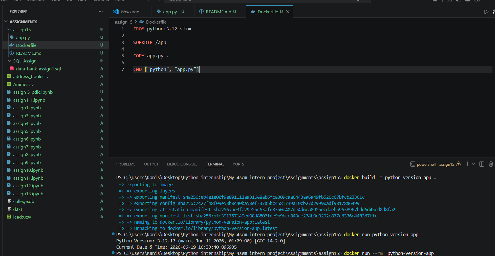

# Dockerized Python Application

## Description

This project demonstrates a simple Dockerized Python application using the `python:3.12-slim` image.

The application prints:

- Current Python Version
- Current Date and Time

---

## Project Structure

```
.
├── app.py
├── Dockerfile
├── screenshot.png
└── README.md
```

---

## Build Docker Image

```bash
docker build -t python-version-app .
```

## Run Docker Container

```bash
docker run python-version-app
```

---

## Sample Output

```text
Python Version: 3.12.11
Current Date & Time: 2026-06-19 21:15:42
```

### Screenshot


